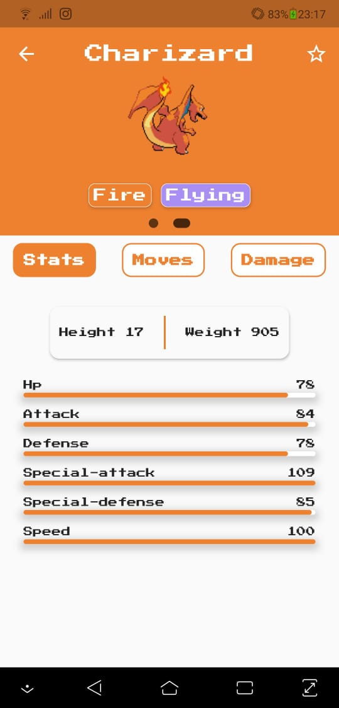

# Pokedex

Pokedex é um aplicativo onde o usuário pode consultar os pokemons e saber informações relevantes sobre o mesmo. Além disso, é possível favoritar seus pokemons para ter acesso a eles de forma mais rápida, inclusive quando você estiver offline.

## Design da aplicação

 

