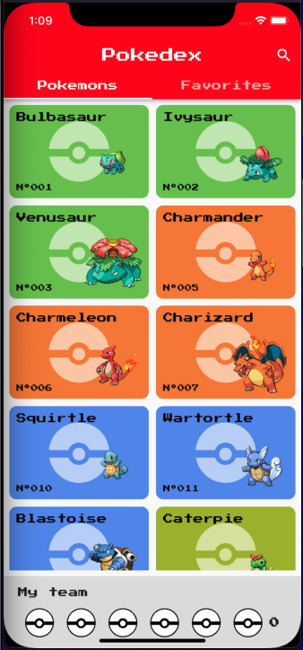
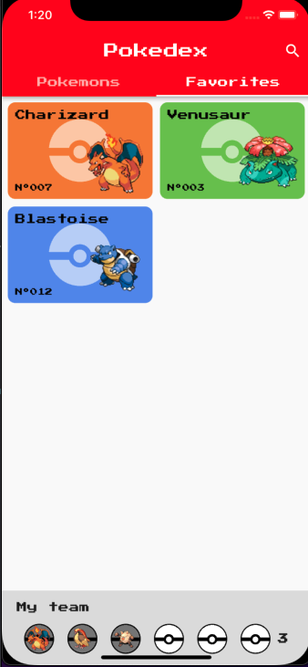
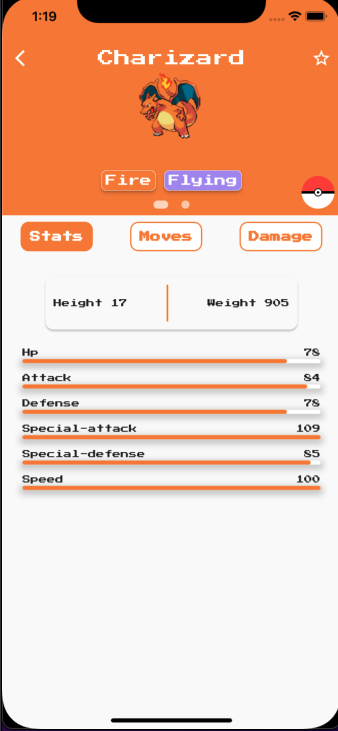
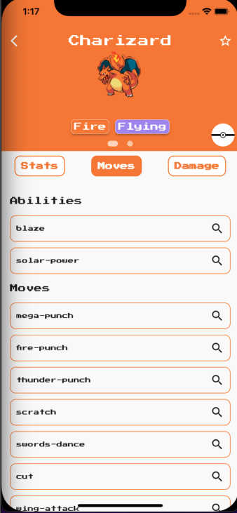
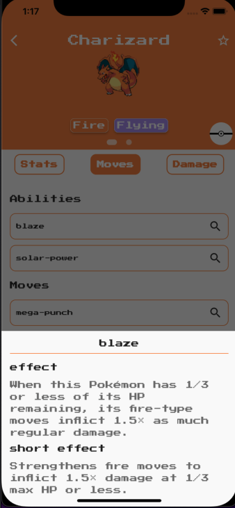
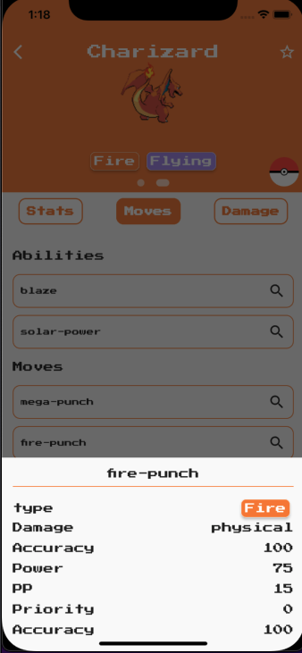
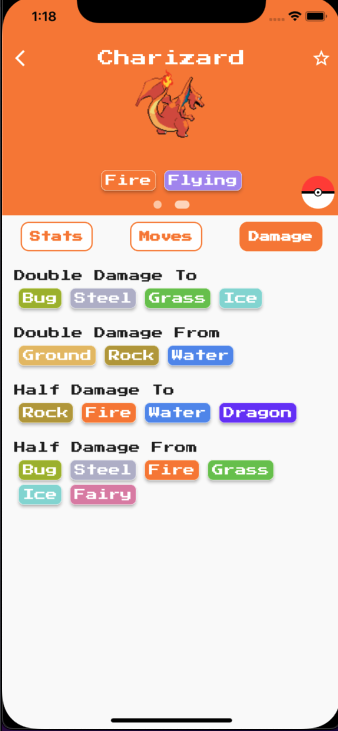

 # Sumario
 * [Sobre o projeto](#sobre-o-projeto)
 * [Design da aplicação](#design-da-aplicação)
 * [Arquitetura](#arquitetura)
 * [Features e diagramas](#features-e-diagramas)
 * [Testes](#testes)
 * [Proximos passos e melhorias que podem ser feitas](#proximos-passos-e-melhorias-que-podem-ser-feitas)


### Sobre o projeto

Pokedex é um aplicativo onde o usuário pode consultar os pokemons e saber informações relevantes sobre o mesmo. Além disso, é possível favoritar seus pokemons para ter acesso a eles de forma mais rápida, inclusive quando você estiver offline. Nele você também pode montar seu time dos sonhos com os seu 6 melhores pokemons.

<div align='center'>
  
</div>


### Design da aplicação

 








### Arquitetura
O código foi feito se baseando nos principios de clean architecture propostos pelo livre [clean architecture](https://www.amazon.com.br/Arquitetura-Limpa-Artes%C3%A3o-Estrutura-Software/dp/8550804606/ref=sr_1_3?keywords=arquitetura+limpa&qid=1653192120&s=books&sprefix=arquitetura+lim%2Cstripbooks%2C188&sr=1-3&ufe=app_do%3Aamzn1.fos.6d798eae-cadf-45de-946a-f477d47705b9) e nos videos de arquitetura limpa do canal do [Deivid Willyan | Flutter](https://www.youtube.com/watch?v=LwOACmXcNQ8&list=PLRpTFz5_57cvCYRhHUui2Bis-5Ybh78TS). Os conceitos aplicados tem como objetivo tentar garantir um codigo com baixo acoplamento e alta coesão para facilitar a manutenabilidade e testabilidade do software.

### Features e diagramas
Nesta sessão é possivel ver quais as funcionalidades da pokedex e alguns [diagramas BPNM](https://www.totvs.com/blog/gestao-industrial/bpmn/#:~:text=O%20BPMN%20%C3%A9%20uma%20representa%C3%A7%C3%A3o,etapa%20do%20processo%20de%20produ%C3%A7%C3%A3o.) que exemplificam como elas funcionam.

1 - Listar pokemons: por padrao a pokedex exibe 20 pokemons e conforme o scroll é realizada ela vai carregando mais pokemons.

2 - Ver detalhes de um pokemon e obter: informaçoes basicas, abilidades e movimentos, bem como saber suas vantagens e fraquezas em relação a outros tipos de pokemon.

3 - Marcar/Desmarcar um pokemon como favorito.

4 - Listagem de pokemons favoritos.

5 - Adicionar/remover pokemon do "my team".

6 - exibir time pokemon.

7 - Pesquisar um pokemon pelo seu nome.

### Testes
Para obter uma maior segurança em relação ao que foi desenvolvido essa aplicaçao conta com dois tipos de testes: testes de unidade e testes de integração. Abaixo temos uma imagem que mostrar a cobertura atual de testes do aplicativo.

Para rodar os testes basta ter o projeto clonado em seu computador e excutar os seguintes comandos no terminal dentro da estrutura de pastas do projeto:

Testes de unidade:
```
flutter test
```

Testes de integração:
```
flutter test integration_test/app_test.dart
```
### Proximos passos e melhorias que podem ser feitas
