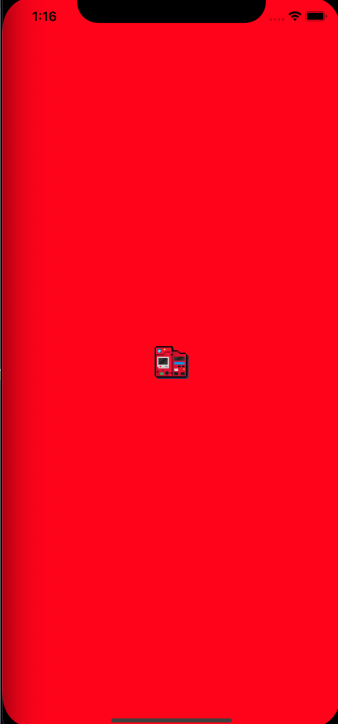
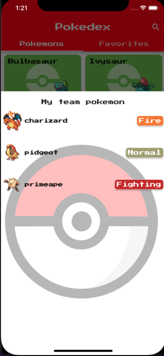

 # Sumário
 * [Sobre o projeto](#sobre-o-projeto)
 * [Design da aplicação](#design-da-aplicação)
 * [Arquitetura](#arquitetura)
 * [Features e diagramas](#features-e-diagramas)
 * [Testes](#testes)
 * [Próximos passos e melhorias que podem ser feitas](#próximos-passos-e-melhorias-que-podem-ser-feitas)


## Sobre o projeto

Pokedex é um aplicativo no qual o usuário pode consultar os pokemons e adquirir informações relevantes sobre eles. Além disso, é possível favoritar os pokemons afim de acessá-los de forma mais rápida, inclusive quando você estiver offline! 
Nele você também poderá montar seu time dos sonhos com os seus 6 melhores pokemons!

Este aplicativo foi feito utilizando como base os dados da API do [pokeapi](https://pokeapi.co/) que possui um catálogo com todas as informações do universo dos pokemons.

<div align='center'>
  
</div>


## Design da aplicação

 




## Arquitetura
O código foi criado com base nos principios de Clean Architecture propostos pelo livro [Clean Architecture](https://www.amazon.com.br/Arquitetura-Limpa-Artes%C3%A3o-Estrutura-Software/dp/8550804606/ref=sr_1_3?keywords=arquitetura+limpa&qid=1653192120&s=books&sprefix=arquitetura+lim%2Cstripbooks%2C188&sr=1-3&ufe=app_do%3Aamzn1.fos.6d798eae-cadf-45de-946a-f477d47705b9) de Robert C. Martin e nos videos de arquitetura limpa do canal de [Deivid Willyan | Flutter](https://www.youtube.com/watch?v=LwOACmXcNQ8&list=PLRpTFz5_57cvCYRhHUui2Bis-5Ybh78TS). Os conceitos aplicados buscam como objetivo garantir um código com baixo acoplamento e alta coesão para facilitar a manutenabilidade e testabilidade do software.

## Features e diagramas
Nesta sessão é possível ver quais as funcionalidades da pokedex e alguns [diagramas BPNM](https://www.totvs.com/blog/gestao-industrial/bpmn/#:~:text=O%20BPMN%20%C3%A9%20uma%20representa%C3%A7%C3%A3o,etapa%20do%20processo%20de%20produ%C3%A7%C3%A3o.) que exemplificam como elas funcionam.

1 - Listar pokemons: por padrão a pokedex exibe 20 pokemons e conforme o scroll é realizado ele vai carregando mais pokemons.

2 - Ver detalhes de um pokemon e obter: Informações básicas, habilidades e movimentos, bem como saber suas vantagens e fraquezas em relação a outros tipos de pokemon.

3 - Marcar/Desmarcar um pokemon como favorito.

4 - Listagem de pokemons favoritos.

5 - Adicionar/remover pokemon do "my team".

6 - Exibir time pokemon.

7 - Pesquisar um pokemon pelo seu nome.

<div align='center'>
  
</div>

## Testes

Para obter uma maior segurança em relação ao que foi desenvolvido essa aplicação conta com dois tipos de testes: testes de unidade e testes de integração. Abaixo temos uma imagem que mostrar a cobertura atual de testes do aplicativo.

<div align='center'>
  
</div>


Para rodar os testes basta ter o projeto clonado em seu computador e excutar os seguintes comandos no terminal dentro da estrutura de pastas do projeto:

Testes de unidade:
```
flutter test
```

Testes de integração:
```
flutter test integration_test/app_test.dart
```
## Próximos passos e melhorias que podem ser feitas

Por conta do tempo, algumas funcionalidades ainda não contemplam com profundidade todos os cenários que eu gostaria. Alguns pontos para serem melhorados:

### Modelagem das entidades
Entender melhor o mapeamento dos dados para saber se realmente todos os dados da API podem vir nulos em algum momento.

### Tratamento de falhas
Tratar melhor os erros da aplicação e reproduzi-los de uma forma mais coerente na interface do usuário.

### Tratamento de conexão com a internet
Criar um objeto responsável por identificar se o aparelho do usuário consegue se comunicar com algum host externo e tratar possíveis problemas de conexão com a internet.

### Armazenamento de dados
Uma solução para melhorar o armazenamento de dados poderia ser integrar os dados com o firebase. Dessa forma o usuário poderia ter seus dados mesmo offiline e/ou acessando outros dispositivos.

### Testes
Apesar da grande maioria dos cenários terem sido testados acredito que daria pra chegar a uma cobertura de 100% nos testes de unidade e cobrir mais alguns casos nos testes de integração que não foram realizados.


